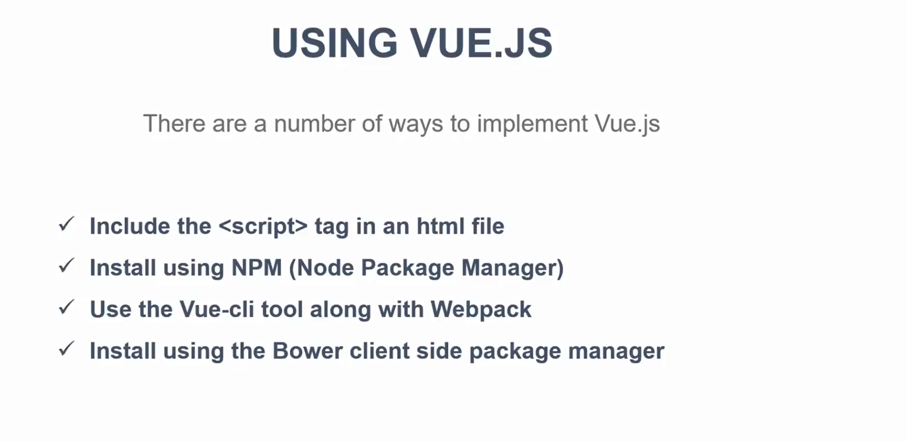

# Source

- [Vue.js 2.0 In 60 Minutes](https://www.youtube.com/watch?v=z6hQqgvGI4Y)

  - 
  

  - 
  

  - 
  

  - 
  

  - 
  

  - 
  

  - 
  

  - 
  

  - 
  

  - 
  

  - 
  

  - 
  

- [Vue JS Crash Course - 2019](https://www.youtube.com/watch?v=Wy9q22isx3U)

  - What is Vue?
  ```
  Vue is a progressive and performant JS framework used for building user interfaces(UIs) and front-end applications.

  Vue is one of the most popular JS frameworks available and is steadily climbing.
  ```

  - Why use Vue?
  ```
  Makes creating UIs and front-end apps much easier

  Less of a learning curve than other frameworks

  Extremely fast and lightweight

  Build powerful SPA apps

  Virtual DOM

  Growing in the industry 
  ```

  - What you should know before learning Vue?
  ```
  JavaScript Fundamentals(Objects, Arrays, Conditionals, etc)

  It may help to learn these first:
  ES6 Module Syntax
  High Order Array Methods - forEach, map, filter
  Arrow Functions
  Fetch API & Promises
  ```

  - Resuable components
  

  - Anatomy of a component
  

  - Vue-cli 3
  ```
  Awesome tool for generating and building Vue apps

  Features includes Babel, TypeScript, ESLint, PostCSS and more

  Includes dev server with hot reload

  Includes Vue UI tool to manage your app in a graphical interface
  ```

  - Vuex for state management
  ```
  Used to manage application level state(similar to Redux, Flux, etc)

  Serves as a central store for all components

  Uses actions to update global state and send down to components

  Used in larger applications
  ```

- [Vue2.5 Crash](https://www.imooc.com/learn/980)

---

# vue_app_playground

## Install Vue-CLI 3
```
npm install --global @vue/cli

vue --version
```

## Create a vue project(vue create command, vue ui graphical interface)
```
vue create vue_app_playground

vue ui
```

## Go into the project directory
```
cd vue_app_playground
```

## Project setup
```
npm install
```

```
npm install vue-resource --save
npm install vue-router --save
```

## Compiles and hot-reloads for development
```
npm run serve
```

## Compiles and minifies for production
```
npm run build
```

## Run your tests
```
npm run test
```

## Lints and fixes files
```
npm run lint
```

## Customize configuration
See [Configuration Reference](https://cli.vuejs.org/config/).
